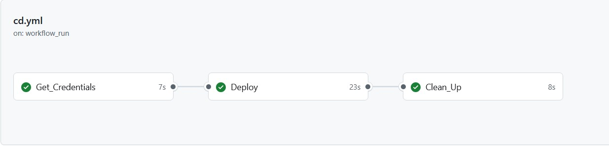

# Shoeshop Backend CI/CD Pipeline

## Giới thiệu
Dự án Shoeshop Backend CI/CD Pipeline triển khai quy trình tự động hóa từ việc kiểm tra mã nguồn (CI) đến việc triển khai ứng dụng (CD) lên môi trường dev. Quy trình này sử dụng GitHub Actions, Docker và Docker Registry để tự động hóa việc xây dựng, kiểm tra, và triển khai ứng dụng.

## Quy trình CI/CD

### 1. **CI Pipeline**
Quy trình Continuous Integration (CI) đảm bảo rằng mã nguồn luôn được kiểm tra và build thành công trước khi triển khai. Khi một Pull Request được tạo hoặc cập nhật, quy trình CI sẽ tự động chạy để kiểm tra mã nguồn, xây dựng Docker image và push nó lên Docker registry.

**Quy trình CI**:
- Kiểm tra mã nguồn.
- Kiểm tra chất lượng mã với các công cụ như SonarQube.
- Build Docker image từ Dockerfile.
- Trivy scan
- Push Docker image lên Docker Registry.

### 2. **CD Pipeline**
Quy trình Continuous Deployment (CD) sẽ được kích hoạt sau khi pipeline CI hoàn thành. Pipeline này sẽ tự động deploy ứng dụng lên môi trường sản xuất (hoặc staging) bằng cách sử dụng Docker.

**Quy trình CD**:
- Lấy thông tin đăng nhập Docker Registry từ Vault.
- Xóa container cũ (nếu có).
- Xóa Docker image cũ (nếu có).
- Đăng nhập vào Docker Registry.
- Kéo image mới từ Docker Registry.
- Chạy container mới.

### 3. **Swagger Documentation**
Sau khi ứng dụng được triển khai thành công, tài liệu Swagger sẽ có sẵn để kiểm tra các API của ứng dụng. Bạn có thể truy cập Swagger UI để xem các endpoints và kiểm tra API một cách trực quan.

## Cấu hình

**Cấu hình GitHub Secrets**:
   - `VAULT_TOKEN`: Token để truy cập Vault.
   - `DOCKER_REGISTRY_CREDENTIAL_PATH`: Đường dẫn tới Docker credentials trong Vault.
   - `JFrog_CREDENTIAL_PATH`: Đường dẫn tới JFrog credentials trong Vault.

## Các bước triển khai

1. **Đẩy mã lên GitHub**:
   Sau khi bạn hoàn thành việc phát triển tính năng mới hoặc sửa lỗi, đẩy mã của bạn lên GitHub.

2. **Kích hoạt pipeline CI**:
   Pipeline CI sẽ tự động chạy khi bạn tạo Pull Request hoặc push vào branch chính.

3. **Hoàn thành quy trình CI**:
   Khi quy trình CI hoàn tất mà không có lỗi, quy trình CD sẽ tự động được kích hoạt.

4. **Kiểm tra ứng dụng**:
   Kiểm tra Swagger UI và các API endpoints để xác nhận rằng ứng dụng đã được triển khai thành công.

## Kết luận
Quy trình CI/CD của Shoeshop Backend giúp tự động hóa việc kiểm tra và triển khai ứng dụng, giúp tiết kiệm thời gian và giảm thiểu lỗi trong quá trình phát triển. Các công cụ như GitHub Actions, Docker và Vault được sử dụng để đảm bảo quy trình CI/CD diễn ra mượt mà và bảo mật.
